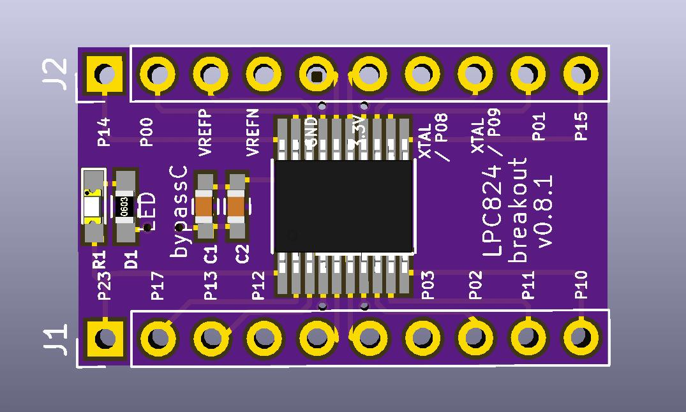
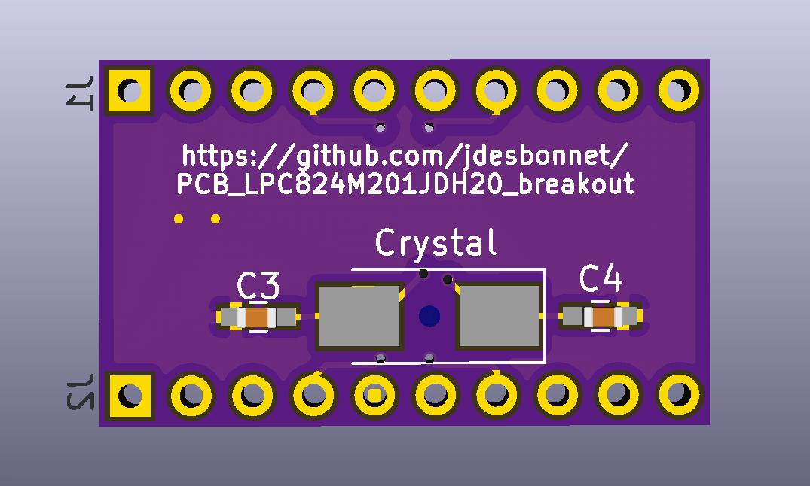

# PCB_LPC824M201JDH20_breakout

Breakout board for TSSOP package version of LPC824 ARM Cortex-M0+ MCU. 

Features:

 * Extra long IC pin leads which makes handsoldering easier.
 * Option for crystal + 2C mounted underside. Crystal component height needs to be 2mm or less.
 * Option for one or two bypass 0602 capacitors (right above the IC).
 * Option for 0602 LED + R on PIO0_23 (package pin 1).
 

## History

Version 0.8.1, 2018-05-12

Changes to silk screen layer to make purpose of passive components clearer. 
Add link to project git repo.

Version 0.8.0, 2018-04-24

Sent to OSHPark.com for fabrication. PCB arrived 2018-05-11. Works as expected. Only thing I'd change is 
marking the optional bypass and LED pads more clearly. I haven't tested the crystal.

